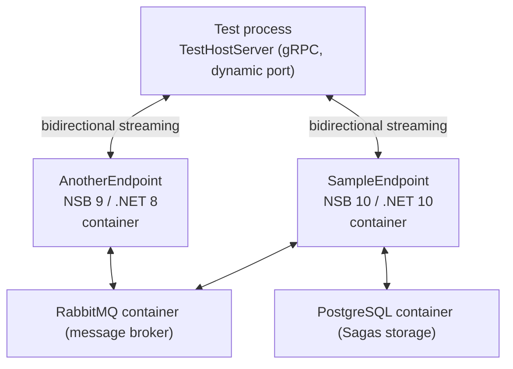

# Getting Started with NServiceBus.IntegrationTesting

This guide walks you through adding integration tests to an existing NServiceBus solution using
NServiceBus.IntegrationTesting. By the end you will have:

- A companion `*.Testing` project for each endpoint you want to test
- One or more named **scenarios** that send messages from inside the endpoint process
- An NUnit test project that starts Docker containers and asserts on handler invocations, message dispatches, saga state, message skips, and failure outcomes

> [!NOTE]
> This guide uses NUnit, but NServiceBus.IntegrationTesting works with any unit testing framework

## What is NServiceBus.IntegrationTesting?

NServiceBus.IntegrationTesting runs your real NServiceBus endpoints as Docker containers and lets your tests observe what happens — which handlers ran, which messages were dispatched, which sagas were started, and whether any messages failed permanently.

Unlike unit tests or acceptance tests that mock the transport, every message here travels over the **real transport** (e.g., RabbitMQ) and is persisted by the **real persistence** (e.g., PostgreSQL). This gives you high confidence that your production configuration is correct.

### How it works



1. The test process starts a lightweight **gRPC host** on a dynamic port.
2. Infrastructure containers (e.g., RabbitMQ, PostgreSQL) start on a shared Docker network.
3. Each endpoint's **companion `*.Testing` image** is built and started as a container.
4. Each endpoint companion embeds a gRPC **agent** that connects home on startup.
5. A test **scenario** — a named entry point in the `*.Testing` project — is executed inside the endpoint process using the real `IMessageSession` and can send messages required to kick off the scenario to test.
6. Each agent, running in real endpoints, streams back handler invocations, saga events, message dispatches, and failure events to the test host.
7. The test awaits conditions via the fluent `ObserveContext` API and then makes assertions.

## Prerequisites

| Requirement | Minimum version |
|---|---|
| .NET SDK | 9.0 |
| Docker Desktop (macOS/Windows) or Docker Engine (Linux) | 20.10 |

> [!NOTE]
> **Tip for Linux CI**: add `WithExtraHost("host.docker.internal", "host-gateway")` to your endpoint container builder if containers cannot resolve `host.docker.internal`. This is already done automatically by `TestEnvironmentBuilder`.

## Project structure

The framework enforces a clean boundary between production code and test infrastructure:

```text
YourEndpoint/                   ← production code, zero test dependencies
  YourEndpointConfig.cs         ← static Create() factory (used by the endpoint and customized by YourEndpoint.Testing)
  Handlers/
    SomeMessageHandler.cs

YourEndpoint.Testing/           ← wraps production config, adds agent + scenarios
  Program.cs                    ← IntegrationTestingBootstrap.RunAsync(...)
  SomeMessageScenario.cs        ← implements Scenario base class
  Dockerfile                    ← builds the testable container image

YourEndpoint.Tests/             ← Unit test project
  WhenSomeMessageIsSent.cs      ← test fixture
```

- **`YourEndpoint/`** has no reference to any testing library and is deployed as-is to production.
- **`YourEndpoint.Testing/`** only runs inside integration tests. It imports the production `Create()` factory and layers on test-specific settings (e.g., fewer retries).
- **`YourEndpoint.Tests/`** references `YourEndpoint.Testing` with `ReferenceOutputAssembly="false"` — this causes the companion project to be compiled as part of the test build (so errors are caught early), but the assembly itself is never loaded by the test process. The Docker image is built at test runtime.

> [!NOTE]
> Project names don't have to follow the schema above. You can use your conventions, and they won't affect in any way how integration tests are set up and executed.

## Step 1 — Create the production endpoint configuration factory

If your production endpoint does not already have a static configuration factory, create one. The factory reads connection strings from environment variables, so it works both in production and inside Docker containers. What is important is that the `*.Testing` endpoint can instantiate the production `EndpointConfiguration`:

<!-- snippet: gs-config-factory -->
<a id='snippet-gs-config-factory'></a>
```cs
// YourEndpoint/YourEndpointConfig.cs
public static class YourEndpointConfig
{
    public static EndpointConfiguration Create()
    {
        var rabbitMqConnectionString =
            Environment.GetEnvironmentVariable("RABBITMQ_CONNECTION_STRING")
            ?? "host=localhost;username=guest;password=guest";

        var config = new EndpointConfiguration("YourEndpoint");

        var transport = new RabbitMQTransport(
            RoutingTopology.Conventional(QueueType.Quorum),
            rabbitMqConnectionString);

        var routing = config.UseTransport(transport);
        routing.RouteToEndpoint(typeof(SomeCommand), "AnotherEndpoint");

        config.UseSerialization<SystemJsonSerializer>();
        config.EnableInstallers();

        return config;
    }
}
```
<sup><a href='/src/Snippets/GettingStartedConfigSnippets.cs#L9-L34' title='Snippet source file'>snippet source</a> | <a href='#snippet-gs-config-factory' title='Start of snippet'>anchor</a></sup>
<!-- endSnippet -->

> **Important**: read all connection strings from environment variables. The framework injects the correct container-network addresses (e.g., `host=rabbitmq`) at startup.

## Step 2 — Create the companion `*.Testing` project

Add a new console project alongside the production endpoint:

```xml
<!-- YourEndpoint.Testing/YourEndpoint.Testing.csproj -->
<Project Sdk="Microsoft.NET.Sdk">
  <PropertyGroup>
    <OutputType>Exe</OutputType>
    <TargetFramework>net10.0</TargetFramework>
    <Nullable>enable</Nullable>
    <ImplicitUsings>enable</ImplicitUsings>
  </PropertyGroup>

  <ItemGroup>
    <ProjectReference Include="..\YourEndpoint\YourEndpoint.csproj" />
  </ItemGroup>

  <ItemGroup>
    <!--
      Pick the agent package that matches your NServiceBus major version.

      NServiceBus 10 (net10.0):  NServiceBus.IntegrationTesting.AgentV10
      NServiceBus 9  (net8.0):   NServiceBus.IntegrationTesting.AgentV9
      NServiceBus 8  (net6.0):   NServiceBus.IntegrationTesting.AgentV8
    -->
    <PackageReference Include="NServiceBus.IntegrationTesting.AgentV10" Version="3.*" />
  </ItemGroup>
</Project>
```

The entry point calls `IntegrationTestingBootstrap.RunAsync`, passing the production factory
and a list of scenarios:

<!-- snippet: gs-bootstrap -->
<a id='snippet-gs-bootstrap'></a>
```cs
// YourEndpoint.Testing/Program.cs
await IntegrationTestingBootstrap.RunAsync(
    "YourEndpoint",
    YourEndpointConfig.Create,
    scenarios: [new SomeCommandScenario()]);
```
<sup><a href='/src/Snippets/GettingStartedConfigSnippets.cs#L40-L46' title='Snippet source file'>snippet source</a> | <a href='#snippet-gs-bootstrap' title='Start of snippet'>anchor</a></sup>
<!-- endSnippet -->

### Overlaying test-specific settings

You can adjust the configuration before handing it off — for example, reducing retries so
that failing messages reach the error queue quickly instead of spending minutes in retry loops:

<!-- snippet: gs-overlay -->
<a id='snippet-gs-overlay'></a>
```cs
await IntegrationTestingBootstrap.RunAsync(
    "YourEndpoint",
    CreateConfig);

static EndpointConfiguration CreateConfig()
{
    var config = YourEndpointConfig.Create();
    config.Recoverability().Immediate(s => s.NumberOfRetries(0));
    config.Recoverability().Delayed(s => s.NumberOfRetries(0));
    return config;
}
```
<sup><a href='/src/Snippets/GettingStartedConfigSnippets.cs#L51-L63' title='Snippet source file'>snippet source</a> | <a href='#snippet-gs-overlay' title='Start of snippet'>anchor</a></sup>
<!-- endSnippet -->

> **Never modify the production `Create()` factory for testing purposes.** Wrap it in the `*.Testing` project and customize settings there for testing purposes.

## Step 3 — Write scenarios

A **scenario** is a named entry point that runs _inside the endpoint process_ using the
real `IMessageSession`. This means messages are sent with the real serializer, real routing,
and real transport — no mocking involved.

<!-- snippet: gs-scenario -->
<a id='snippet-gs-scenario'></a>
```cs
// YourEndpoint.Testing/SomeCommandScenario.cs
public class SomeCommandScenario : Scenario
{
    public override string Name => "SomeCommand Scenario";

    public override async Task Execute(
        IMessageSession session,
        Dictionary<string, string> args,
        CancellationToken cancellationToken = default)
    {
        var id = Guid.Parse(args["ID"]);
        await session.Send(new SomeCommand { Id = id });
    }
}
```
<sup><a href='/src/Snippets/GettingStartedScenarioSnippets.cs#L7-L22' title='Snippet source file'>snippet source</a> | <a href='#snippet-gs-scenario' title='Start of snippet'>anchor</a></sup>
<!-- endSnippet -->

Key points:

- `Name` must be unique within an endpoint and is used by the test to trigger the scenario.
- `args` is a `Dictionary<string, string>` passed from the test — use it for per-test data relevant to the scenario, e.g., permutations.
- The `Execute` method runs inside the endpoint process. Any message type available there is available here; no special constructors or test-only types are needed.

## Step 4 — Write the Dockerfile for the companion project

The Dockerfile builds the `*.Testing` project (not the production project) into a container
image. The build context is the `src/` directory, so `COPY` instructions can reach all sibling
projects.

```dockerfile
# YourEndpoint.Testing/Dockerfile
# Build context: src/
# docker build -f YourEndpoint.Testing/Dockerfile .

FROM mcr.microsoft.com/dotnet/sdk:10.0 AS build
WORKDIR /src

# Copy project files first for layer-cached restore
COPY YourMessages/YourMessages.csproj YourMessages/
COPY YourEndpoint/YourEndpoint.csproj YourEndpoint/
COPY YourEndpoint.Testing/YourEndpoint.Testing.csproj YourEndpoint.Testing/

RUN dotnet restore YourEndpoint.Testing/YourEndpoint.Testing.csproj

# Copy source and publish
COPY YourMessages/ YourMessages/
COPY YourEndpoint/ YourEndpoint/
COPY YourEndpoint.Testing/ YourEndpoint.Testing/

RUN dotnet publish YourEndpoint.Testing/YourEndpoint.Testing.csproj -c Release -o /app/publish

FROM mcr.microsoft.com/dotnet/runtime:10.0
WORKDIR /app
COPY --from=build /app/publish .
ENTRYPOINT ["dotnet", "YourEndpoint.Testing.dll"]
```

> **Do not use `--no-restore`** on the `dotnet publish` step. On ARM64/Apple Silicon with Linux/AMD64 containers, the restore and publish must share the same RID context.

### Add a `.dockerignore` file

Place a `.dockerignore` file in the **build context directory** (the path you pass to `.WithDockerfileDirectory()`). Without it, a local `dotnet build` populates `bin/` and `obj/` with native artifacts that change the Testcontainers content hash (triggering unnecessary image rebuilds) and can interfere with `dotnet publish` inside the container on ARM64.

```
# <build-context-root>/.dockerignore
**/bin/
**/obj/
```

## Step 5 — Create the test project

Create a test project, using NUnit in the example below, that references both the testing framework and the `*.Testing` companion projects:

```xml
<!-- YourEndpoint.Tests/YourEndpoint.Tests.csproj -->
<Project Sdk="Microsoft.NET.Sdk">
  <PropertyGroup>
    <TargetFramework>net10.0</TargetFramework>
    <Nullable>enable</Nullable>
    <ImplicitUsings>enable</ImplicitUsings>
    <IsPackable>false</IsPackable>
  </PropertyGroup>

  <ItemGroup>
    <PackageReference Include="Microsoft.NET.Test.Sdk" Version="17.12.0" />
    <PackageReference Include="NUnit" Version="4.2.2" />
    <PackageReference Include="NUnit3TestAdapter" Version="4.6.0">
      <PrivateAssets>all</PrivateAssets>
      <IncludeAssets>runtime; build; native; contentfiles; analyzers; buildtransitive</IncludeAssets>
    </PackageReference>
    <PackageReference Include="Testcontainers" Version="4.10.0" />
    <PackageReference Include="NServiceBus.IntegrationTesting" Version="3.*" />
    <!--
      Add the infrastructure extension packages you use.
      Each lives in a separate NuGet package so you only pull in what you need.
    -->
    <PackageReference Include="NServiceBus.IntegrationTesting.RabbitMQ" Version="3.*" />
    <PackageReference Include="NServiceBus.IntegrationTesting.PostgreSql" Version="3.*" />
  </ItemGroup>

  <ItemGroup>
    <!--
      ReferenceOutputAssembly="false": compile the companion project (catches errors early)
      but do not load its assembly at runtime — Docker builds the image instead.
    -->
    <ProjectReference Include="..\YourEndpoint.Testing\YourEndpoint.Testing.csproj"
                      ReferenceOutputAssembly="false"
                      Private="false" />
  </ItemGroup>
</Project>
```

## Step 6 — Write test fixtures

### Basic fixture structure

Each test fixture manages a shared `TestEnvironment` that is started once at the beginning of the fixture and torn down afterward. Starting the environment (building Docker images, starting containers) is expensive, so share it across all tests in the fixture. NServiceBus endpoints should be stateless and thus reused across different tests. What might require being "fresh" before each test is the underlying infrastructure, such as the message broker, to prevent leftover in-flight messages or saga instances to affect the next test. The way tests are set up depends on your requirements.

`[NonParallelizable]` prevents NUnit from running tests within the fixture concurrently. Integration tests share a single broker and database, so running them in parallel would cause correlation IDs, saga state, and in-flight messages from one test to interfere with another. Keep this attribute on every integration test fixture.

#### Test isolation

Each scenario execution is tied to a unique correlation ID, so events from different tests do not cross-contaminate the `ObserveContext` listeners. However, **saga state is persisted across tests** — a saga started in one test will still be in the database when the next test runs. Strategies for dealing with this:

- **Use unique IDs per test** (recommended) — generate a fresh `Guid` for each test and pass it to the scenario. Each test then works with a distinct saga instance.
- **Purge saga state in `[SetUp]`** — truncate the saga tables between tests if your persistence allows it.
- **Restart the environment per fixture** — heavier but guarantees a clean slate; acceptable when fixture setup time is short.

<!-- snippet: gs-test-fixture -->
<a id='snippet-gs-test-fixture'></a>
```cs
[TestFixture]
[NonParallelizable]
public class WhenSomeCommandIsSent
{
    static TestEnvironment _env = null!;
    static EndpointHandle _yourEndpoint = null!;

    [OneTimeSetUp]
    public static async Task SetUp()
    {
        _env = await new TestEnvironmentBuilder()
            .WithDockerfileDirectory(TestEnvironmentBuilder.FindRootByDirectory(".git", "src"))
            .UseRabbitMQ()
            .UsePostgreSql()
            .AddEndpoint("YourEndpoint", "YourEndpoint.Testing/Dockerfile")
            .StartAsync();

        _yourEndpoint = _env.GetEndpoint("YourEndpoint");
    }

    [OneTimeTearDown]
    public static Task TearDown() => _env.DisposeAsync().AsTask();

    [Test]
    public async Task Handler_should_be_invoked()
    {
        var correlationId = await _yourEndpoint.ExecuteScenarioAsync(
            "SomeCommand Scenario",
            new Dictionary<string, string> { { "ID", Guid.NewGuid().ToString() } });

        // this is the overall test timeout
        using var cts = new CancellationTokenSource(TimeSpan.FromSeconds(30));

        var results = await _env.Observe(correlationId, cts.Token)
            .HandlerInvoked("SomeMessageHandler")
            .WhenAllAsync();

        Assert.That(
            results.HandlerInvoked("SomeMessageHandler").EndpointName,
            Is.EqualTo("YourEndpoint"));
    }
}
```
<sup><a href='/src/Snippets/GettingStartedTestFixtureSnippets.cs#L6-L49' title='Snippet source file'>snippet source</a> | <a href='#snippet-gs-test-fixture' title='Start of snippet'>anchor</a></sup>
<!-- endSnippet -->

### Executing a scenario

<!-- snippet: gs-execute-scenario -->
<a id='snippet-gs-execute-scenario'></a>
```cs
var correlationId = await _yourEndpoint.ExecuteScenarioAsync(
    "SomeCommand Scenario",
    new Dictionary<string, string> { { "ID", Guid.NewGuid().ToString() } });
```
<sup><a href='/src/Snippets/GettingStartedObservingSnippets.cs#L14-L18' title='Snippet source file'>snippet source</a> | <a href='#snippet-gs-execute-scenario' title='Start of snippet'>anchor</a></sup>
<!-- endSnippet -->

- `ExecuteScenarioAsync` returns a **correlation ID** — a string that ties all events
  produced by this scenario execution together.
- The `args` dictionary is forwarded to `Scenario.Execute` inside the endpoint process.

## Step 7 — Observing results

The `ObserveContext` API lets you declare what you are waiting for before calling `WhenAllAsync()`. Because all listeners are registered immediately, no event can be missed between registrations — even if a handler runs extremely fast.

> [!IMPORTANT]
> Register **all** conditions before awaiting `WhenAllAsync()`.

### Waiting for a handler invocation

<!-- snippet: gs-handler-invocation -->
<a id='snippet-gs-handler-invocation'></a>
```cs
var results = await _env.Observe(correlationId, cts.Token)
    .HandlerInvoked("SomeMessageHandler")
    .HandlerInvoked("AnotherMessageHandler")
    .WhenAllAsync();

// The last (or only) invocation of the handler:
var evt = results.HandlerInvoked("SomeMessageHandler");
Assert.That(evt.EndpointName, Is.EqualTo("YourEndpoint"));
```
<sup><a href='/src/Snippets/GettingStartedObservingSnippets.cs#L26-L35' title='Snippet source file'>snippet source</a> | <a href='#snippet-gs-handler-invocation' title='Start of snippet'>anchor</a></sup>
<!-- endSnippet -->

The string passed to `HandlerInvoked` identifies the handler class. Three forms are accepted and all resolve to the same type:

| Form | Example |
|---|---|
| Short name | `"SomeMessageHandler"` |
| Namespace-qualified | `"MyEndpoint.Handlers.SomeMessageHandler"` |
| Assembly-qualified | `"MyEndpoint.Handlers.SomeMessageHandler, MyEndpoint, Version=1.0.0.0, ..."` |

Use the short name for brevity. Use a more qualified form when two handlers share the same short name in different namespaces or assemblies.

### Waiting for a saga invocation

> [!IMPORTANT]
> Saga invocations are tracked **separately** from plain handler invocations. Use `.SagaInvoked()` for sagas and `.HandlerInvoked()` for message handlers — calling the wrong one means the condition never fires and the test times out.

Sagas are tracked separately from plain handlers, so you can distinguish between the two:

<!-- snippet: gs-saga-invocation -->
<a id='snippet-gs-saga-invocation'></a>
```cs
var results = await _env.Observe(correlationId, cts.Token)
    .SagaInvoked("OrderSaga")
    .WhenAllAsync();

var sagaEvt = results.SagaInvoked("OrderSaga");
Assert.Multiple(() =>
{
    Assert.That(sagaEvt.IsSaga, Is.True);
    Assert.That(sagaEvt.SagaIsNew, Is.True);
    Assert.That(sagaEvt.SagaIsCompleted, Is.False);
});
```
<sup><a href='/src/Snippets/GettingStartedObservingSnippets.cs#L43-L55' title='Snippet source file'>snippet source</a> | <a href='#snippet-gs-saga-invocation' title='Start of snippet'>anchor</a></sup>
<!-- endSnippet -->

Fields available on a `HandlerInvokedEvent` for sagas:

| Field | Description |
|---|---|
| `EndpointName` | Logical endpoint name |
| `IsSaga` | Always `true` for saga invocations |
| `SagaIsNew` | `true` if the saga instance was created by this message |
| `SagaIsCompleted` | `true` if `MarkAsComplete()` was called |
| `SagaNotFound` | `true` if no existing instance matched |
| `SagaId` | The saga data `Id` |
| `SagaTypeName` | The full type name of the saga class |

### Waiting for a message dispatch

<!-- snippet: gs-message-dispatch -->
<a id='snippet-gs-message-dispatch'></a>
```cs
var results = await _env.Observe(correlationId, cts.Token)
    .MessageDispatched("AnotherMessage")
    .WhenAllAsync();

var dispatch = results.MessageDispatched("AnotherMessage");
Assert.Multiple(() =>
{
    Assert.That(dispatch.EndpointName, Is.EqualTo("YourEndpoint"));
    Assert.That(dispatch.Intent, Is.EqualTo("Send"));   // or "Publish", "Reply", "RequestTimeout"
});
```
<sup><a href='/src/Snippets/GettingStartedObservingSnippets.cs#L63-L74' title='Snippet source file'>snippet source</a> | <a href='#snippet-gs-message-dispatch' title='Start of snippet'>anchor</a></sup>
<!-- endSnippet -->

The string passed to `MessageDispatched` identifies the message class. The same three forms accepted by `HandlerInvoked` (short name, namespace-qualified, assembly-qualified) all work here too.

### Waiting for a message failure

There are cases in which we want to test the error path. For example, if we do something, we expect a message to land in the error queue. Use `MessageFailed()` alone when you expect a message to be permanently sent to the error queue. It cannot be combined with success conditions:

<!-- snippet: gs-message-failure -->
<a id='snippet-gs-message-failure'></a>
```cs
var results = await _env.Observe(correlationId, cts.Token)
    .MessageFailed()
    .WhenAllAsync();

var failure = results.MessageFailed();
Assert.Multiple(() =>
{
    Assert.That(failure.EndpointName, Is.EqualTo("AnotherEndpoint"));
    Assert.That(failure.ExceptionMessage, Does.Contain("expected error text"));
    // The message type is available via NServiceBus headers:
    Assert.That(failure.Headers["NServiceBus.EnclosedMessageTypes"],
        Does.Contain("FailingMessage"));
});
```
<sup><a href='/src/Snippets/GettingStartedObservingSnippets.cs#L82-L96' title='Snippet source file'>snippet source</a> | <a href='#snippet-gs-message-failure' title='Start of snippet'>anchor</a></sup>
<!-- endSnippet -->

Fields available on a `MessageFailedEvent`:

| Field | Description |
|---|---|
| `EndpointName` | Logical endpoint name that sent the message to the error queue |
| `ExceptionMessage` | The exception message from the handler that caused the failure |
| `Headers` | `IReadOnlyDictionary<string, string>` — full NServiceBus headers; use `Headers["NServiceBus.EnclosedMessageTypes"]` to get the message type |
| `CorrelationId` | The correlation ID tying the failure to the scenario execution |

> **Tip**: Tweak `NumberOfRetries(0)` in the `*.Testing` project so messages fail
> immediately rather than spending time in retry loops:
>
> ```csharp
> config.Recoverability().Immediate(s => s.NumberOfRetries(0));
> config.Recoverability().Delayed(s => s.NumberOfRetries(0));
> ```

### Fast-fail on unexpected permanent failures

Even when you are **not** using `.MessageFailed()`, the framework monitors for permanent
failures. If a message with the observed correlation ID is sent to the error queue before
all success conditions are met, `WhenAllAsync()` throws a `MessageFailedException`
immediately instead of waiting for the cancellation token to expire.

This means you get a clear, descriptive error rather than a generic
`OperationCanceledException` timeout:

<!-- snippet: gs-fast-fail -->
<a id='snippet-gs-fast-fail'></a>
```cs
// MessageFailedException is thrown if the handler fails permanently,
// even though the test only registered success conditions.
var results = await _env.Observe(correlationId, cts.Token)
    .HandlerInvoked("SomeMessageHandler")
    .WhenAllAsync();
```
<sup><a href='/src/Snippets/GettingStartedObservingSnippets.cs#L104-L110' title='Snippet source file'>snippet source</a> | <a href='#snippet-gs-fast-fail' title='Start of snippet'>anchor</a></sup>
<!-- endSnippet -->

`MessageFailedException` exposes `CorrelationId` and `Headers` properties for diagnostics.

## Advanced topics

### Multi-endpoint scenarios

Add as many endpoints as you need. Each must have its own `*.Testing` project and Dockerfile:

<!-- snippet: gs-multi-endpoint -->
<a id='snippet-gs-multi-endpoint'></a>
```cs
_env = await new TestEnvironmentBuilder()
    .WithDockerfileDirectory(srcDir)
    .UseRabbitMQ()
    .UsePostgreSql()
    .AddEndpoint("OrdersEndpoint", "OrdersEndpoint.Testing/Dockerfile")
    .AddEndpoint("BillingEndpoint", "BillingEndpoint.Testing/Dockerfile")
    .AddEndpoint("ShippingEndpoint", "ShippingEndpoint.Testing/Dockerfile")
    .StartAsync();
```
<sup><a href='/src/Snippets/GettingStartedAdvancedSnippets.cs#L23-L32' title='Snippet source file'>snippet source</a> | <a href='#snippet-gs-multi-endpoint' title='Start of snippet'>anchor</a></sup>
<!-- endSnippet -->

Endpoints in the same test environment share the Docker network. They can send messages to
each other exactly as they would in production.

### Testing saga timeouts

Sagas that use `RequestTimeout` may have delays that are far too long for tests (minutes or
hours in production). Use a `TimeoutRule` to shorten them in the `*.Testing` project:

<!-- snippet: gs-timeout-bootstrap -->
<a id='snippet-gs-timeout-bootstrap'></a>
```cs
// YourEndpoint.Testing/Program.cs
await IntegrationTestingBootstrap.RunAsync(
    "YourEndpoint",
    YourEndpointConfig.Create,
    scenarios: [new SomeCommandScenario()],
    timeoutRules: [TimeoutRule.For<OrderProcessingTimeout>(TimeSpan.FromSeconds(5))]);
```
<sup><a href='/src/Snippets/GettingStartedAdvancedSnippets.cs#L37-L44' title='Snippet source file'>snippet source</a> | <a href='#snippet-gs-timeout-bootstrap' title='Start of snippet'>anchor</a></sup>
<!-- endSnippet -->

Then wait for the timeout-triggered handler in your test:

<!-- snippet: gs-timeout-assertions -->
<a id='snippet-gs-timeout-assertions'></a>
```cs
using var cts = new CancellationTokenSource(TimeSpan.FromSeconds(30));

var results = await _env.Observe(correlationId, cts.Token)
    .SagaInvoked("OrderSaga")
    .MessageDispatched("OrderProcessingTimeout")
    .HandlerInvoked("TimeoutCompletionHandler")
    .WhenAllAsync();

Assert.That(results.MessageDispatched("OrderProcessingTimeout").Intent,
    Is.EqualTo("RequestTimeout"));
```
<sup><a href='/src/Snippets/GettingStartedAdvancedSnippets.cs#L51-L62' title='Snippet source file'>snippet source</a> | <a href='#snippet-gs-timeout-assertions' title='Start of snippet'>anchor</a></sup>
<!-- endSnippet -->

### Skipping messages

Sometimes you want to test a scenario where a message is **not** processed — for example, verifying that when an endpoint does not handle a `ProcessPayment` message, an upstream saga escalates via a timeout. Use a `SkipRule` to ACK the message without invoking any handlers, and observe the skip in the test:

<!-- snippet: gs-skip-bootstrap -->
<a id='snippet-gs-skip-bootstrap'></a>
```cs
// YourEndpoint.Testing/Program.cs
await IntegrationTestingBootstrap.RunAsync(
    "YourEndpoint",
    YourEndpointConfig.Create,
    scenarios: [new SomeCommandScenario()],
    skipRules: [SkipRule.For<ProcessPayment>()]);
```
<sup><a href='/src/Snippets/GettingStartedAdvancedSnippets.cs#L173-L180' title='Snippet source file'>snippet source</a> | <a href='#snippet-gs-skip-bootstrap' title='Start of snippet'>anchor</a></sup>
<!-- endSnippet -->

The message is consumed from the queue (no dead-lettering, no retries) and a `MessageSkippedEvent` is reported to the test host. Wait for it in the test:

<!-- snippet: gs-skip-observation -->
<a id='snippet-gs-skip-observation'></a>
```cs
using var cts = new CancellationTokenSource(TimeSpan.FromSeconds(30));

var results = await _env.Observe(correlationId, cts.Token)
    .MessageSkipped("ProcessPayment")
    .WhenAllAsync();

var skip = results.MessageSkipped("ProcessPayment");
Assert.That(skip.EndpointName, Is.EqualTo("YourEndpoint"));
```
<sup><a href='/src/Snippets/GettingStartedAdvancedSnippets.cs#L187-L196' title='Snippet source file'>snippet source</a> | <a href='#snippet-gs-skip-observation' title='Start of snippet'>anchor</a></sup>
<!-- endSnippet -->

You can also pass a predicate to skip only messages that meet a condition:

<!-- snippet: gs-skip-predicate -->
<a id='snippet-gs-skip-predicate'></a>
```cs
// YourEndpoint.Testing/Program.cs
await IntegrationTestingBootstrap.RunAsync(
    "YourEndpoint",
    YourEndpointConfig.Create,
    scenarios: [new SomeCommandScenario()],
    skipRules: [SkipRule.For<ProcessPayment>(msg => msg.Amount > 1000)]);
```
<sup><a href='/src/Snippets/GettingStartedAdvancedSnippets.cs#L201-L208' title='Snippet source file'>snippet source</a> | <a href='#snippet-gs-skip-predicate' title='Start of snippet'>anchor</a></sup>
<!-- endSnippet -->

`MessageSkipped` cannot be combined with `MessageFailed` in the same `ObserveContext`.

### Predicate overloads

All `HandlerInvoked`, `SagaInvoked`, and `MessageDispatched` conditions support two additional overloads that let you encode business assertions directly in the done condition — the condition fires only when the predicate on the latest event returns `true`:

<!-- snippet: gs-single-predicate -->
<a id='snippet-gs-single-predicate'></a>
```cs
// Only fires when the saga is new — no need to assert afterward
var results = await _env.Observe(correlationId, cts.Token)
    .SagaInvoked("OrderSaga", evt => evt.SagaIsNew)
    .WhenAllAsync();
```
<sup><a href='/src/Snippets/GettingStartedAdvancedSnippets.cs#L70-L75' title='Snippet source file'>snippet source</a> | <a href='#snippet-gs-single-predicate' title='Start of snippet'>anchor</a></sup>
<!-- endSnippet -->

**List predicate** — the condition fires when the accumulated list of matching events satisfies the predicate. Use this when you need to reason about multiple events together:

<!-- snippet: gs-list-predicate -->
<a id='snippet-gs-list-predicate'></a>
```cs
// Wait until we have seen at least 3 dispatches of the same type
var results = await _env.Observe(correlationId, cts.Token)
    .MessageDispatched("OrderStatusUpdated", all => all.Count >= 3)
    .WhenAllAsync();

var dispatches = results.MessageDispatches("OrderStatusUpdated");
Assert.That(dispatches, Has.Count.GreaterThanOrEqualTo(3));
```
<sup><a href='/src/Snippets/GettingStartedAdvancedSnippets.cs#L83-L91' title='Snippet source file'>snippet source</a> | <a href='#snippet-gs-list-predicate' title='Start of snippet'>anchor</a></sup>
<!-- endSnippet -->

### Running in CI

Integration tests work in CI without any special configuration, with one caveat: on Linux Docker Engine (GitHub Actions, most CI hosts), BuildKit tags images asynchronously. The framework uses a stable image tag of the form `localhost/nsb-integration-testing/{endpoint-name}:latest`. If the image was just built, the tag may not be visible immediately, causing the container startup to fail.

The recommended fix is to **pre-build the endpoint images in a dedicated CI step** before running the tests, using the exact same tag:

```yaml
# .github/workflows/ci.yml (excerpt)
- name: Pre-build endpoint Docker images
  run: |
    docker build \
      -f src/YourEndpoint.Testing/Dockerfile \
      -t localhost/nsb-integration-testing/yourendpoint:latest \
      src/
    docker build \
      -f src/AnotherEndpoint.Testing/Dockerfile \
      -t localhost/nsb-integration-testing/anotherendpoint:latest \
      src/

- name: Run integration tests
  run: dotnet test src/YourEndpoint.Tests/
```

The image name must be **all lowercase** and match the endpoint name you pass to `.AddEndpoint()`. When the tag already exists, `TestEnvironmentBuilder` finds a full cache hit and skips the async tagging step entirely, so the race condition cannot occur.

> **Note for `host.docker.internal`**: on Linux Docker Engine, containers cannot resolve `host.docker.internal` by default. `TestEnvironmentBuilder` automatically applies `WithExtraHost("host.docker.internal", "host-gateway")` to all endpoint containers, so this resolves without any action on your part.

### Stubbing external HTTP services with WireMock

If your endpoint calls an external HTTP service, use `.UseWireMock()` to start an embedded [WireMock.Net](https://github.com/WireMock-Net/WireMock.Net) stub server. The framework automatically injects the `WIREMOCK_URL` environment variable into every endpoint container.

<!-- snippet: gs-wiremock-setup -->
<a id='snippet-gs-wiremock-setup'></a>
```cs
// *.Tests.csproj: add <PackageReference Include="WireMock.Net" Version="1.25.0" />

_env = await new TestEnvironmentBuilder()
    .WithDockerfileDirectory(srcDir)
    .UseRabbitMQ()
    .UseWireMock()                       // starts the stub server
    .AddEndpoint("YourEndpoint", "YourEndpoint.Testing/Dockerfile")
    .StartAsync();
```
<sup><a href='/src/Snippets/GettingStartedAdvancedSnippets.cs#L98-L107' title='Snippet source file'>snippet source</a> | <a href='#snippet-gs-wiremock-setup' title='Start of snippet'>anchor</a></sup>
<!-- endSnippet -->

In your endpoint, read `WIREMOCK_URL` from the environment:

<!-- snippet: gs-wiremock-endpoint -->
<a id='snippet-gs-wiremock-endpoint'></a>
```cs
// Only calls the external service when the variable is set (i.e., in test mode)
var externalUrl = Environment.GetEnvironmentVariable("WIREMOCK_URL");
if (externalUrl is not null)
{
    var response = await _http.GetStringAsync($"{externalUrl}/api/data", ct);
}
```
<sup><a href='/src/Snippets/GettingStartedAdvancedSnippets.cs#L260-L267' title='Snippet source file'>snippet source</a> | <a href='#snippet-gs-wiremock-endpoint' title='Start of snippet'>anchor</a></sup>
<!-- endSnippet -->

In the test, configure the stub before triggering the scenario, then verify the request was received afterward:

<!-- snippet: gs-wiremock-test -->
<a id='snippet-gs-wiremock-test'></a>
```cs
[Test]
public async Task Handler_calls_external_service()
{
    // Configure stub first so no request is missed
    _env.WireMock!
        .Given(Request.Create().WithPath("/api/data").UsingGet())
        .RespondWith(Response.Create().WithStatusCode(200).WithBody("ok"));

    var correlationId = await _yourEndpoint.ExecuteScenarioAsync(
        "SomeCommand",
        new Dictionary<string, string> { { "ID", Guid.NewGuid().ToString() } });

    using var cts = new CancellationTokenSource(TimeSpan.FromSeconds(15));
    await _env.Observe(correlationId, cts.Token)
        .HandlerInvoked("SomeMessageHandler")
        .WhenAllAsync();

    Assert.That(
        _env.WireMock!.LogEntries.Any(e => e.RequestMessage.Path == "/api/data"),
        Is.True);
}
```
<sup><a href='/src/Snippets/GettingStartedAdvancedSnippets.cs#L110-L132' title='Snippet source file'>snippet source</a> | <a href='#snippet-gs-wiremock-test' title='Start of snippet'>anchor</a></sup>
<!-- endSnippet -->

### Dumping container logs on failure

When a test fails, endpoint container logs are invaluable for diagnosing what went wrong. Add a `[TearDown]` method that dumps them only on failure:

<!-- snippet: gs-dump-logs -->
<a id='snippet-gs-dump-logs'></a>
```cs
[TearDown]
public async Task DumpContainerLogsOnFailure()
{
    if (TestContext.CurrentContext.Result.Outcome.Status
            != NUnit.Framework.Interfaces.TestStatus.Failed)
        return;

    var (stdout, stderr) = await _env.GetEndpointContainerLogsAsync("YourEndpoint");
    TestContext.Out.WriteLine("=== YourEndpoint stdout ===");
    TestContext.Out.WriteLine(stdout);
    TestContext.Out.WriteLine("=== YourEndpoint stderr ===");
    TestContext.Out.WriteLine(stderr);
}
```
<sup><a href='/src/Snippets/GettingStartedAdvancedSnippets.cs#L134-L148' title='Snippet source file'>snippet source</a> | <a href='#snippet-gs-dump-logs' title='Start of snippet'>anchor</a></sup>
<!-- endSnippet -->

### Adjusting the agent connection timeout

By default, `StartAsync` waits up to 120 seconds for all endpoint agents to connect. Adjust this if your Docker image builds or container startup is particularly slow:

<!-- snippet: gs-agent-timeout -->
<a id='snippet-gs-agent-timeout'></a>
```cs
_env = await new TestEnvironmentBuilder()
    .WithDockerfileDirectory(srcDir)
    .UseRabbitMQ()
    .AddEndpoint("YourEndpoint", "YourEndpoint.Testing/Dockerfile")
    .WithAgentConnectionTimeout(TimeSpan.FromMinutes(5))
    .StartAsync();
```
<sup><a href='/src/Snippets/GettingStartedAdvancedSnippets.cs#L161-L168' title='Snippet source file'>snippet source</a> | <a href='#snippet-gs-agent-timeout' title='Start of snippet'>anchor</a></sup>
<!-- endSnippet -->

### Web applications hosting NServiceBus

When an endpoint is an ASP.NET Core web application, the test trigger is an HTTP request rather than a message. NServiceBus.IntegrationTesting supports this pattern with three building blocks:

1. **`CorrelationIdMiddleware`** — seeds the correlation ID from the inbound `X-Correlation-Id` header so the NServiceBus pipeline can stamp it on every outgoing message.
2. **`CorrelationIdPropagationHandler`** — a `DelegatingHandler` that forwards the correlation ID onto outgoing HTTP calls so the chain stays connected across service boundaries.
3. **`IntegrationTestingBootstrap.Configure`** (the `IServiceCollection` overload) — wires the agent behaviors into the NServiceBus pipeline and registers an `IHostedService` that connects to the test host automatically once the endpoint starts.

#### Splitting production configuration

Start by extracting the production `Program.cs` setup into static helpers so the companion project can reuse them without duplicating code:

<!-- snippet: gs-webapp-config -->
<a id='snippet-gs-webapp-config'></a>
```cs
public static class WebAppConfig
{
    public static WebApplicationBuilder CreateBuilder(string[] args)
    {
        var builder = WebApplication.CreateBuilder(args);
        builder.Services.AddControllers();
        // ... register other services
        return builder;
    }

    public static EndpointConfiguration CreateNsbConfig(HostBuilderContext ctx)
    {
        var config = new EndpointConfiguration("WebApp");
        // ... configure transport, persistence, etc.
        return config;
    }

    public static void ConfigurePipeline(WebApplication app)
    {
        app.MapControllers();
        // ... add other middleware
    }
}
```
<sup><a href='/src/Snippets/GettingStartedWebAppSnippets.cs#L15-L39' title='Snippet source file'>snippet source</a> | <a href='#snippet-gs-webapp-config' title='Start of snippet'>anchor</a></sup>
<!-- endSnippet -->

#### The companion `Program.cs`

The companion `Program.cs` calls `IntegrationTestingBootstrap.Configure` instead of starting the endpoint directly. Pass `builder.Services` so the framework can register the connector hosted service that dials home after startup.

<!-- snippet: gs-webapp-testing-program -->
<a id='snippet-gs-webapp-testing-program'></a>
```cs
public static async Task Main(string[] args)
{
    var builder = WebAppConfig.CreateBuilder(args);

    // Wire the agent into NServiceBus and register the connector hosted service.
    // The IServiceCollection overload handles everything: behavior registration
    // and connecting to the test host after the endpoint starts.
    builder.Host.UseNServiceBus(ctx =>
    {
        var config = WebAppConfig.CreateNsbConfig(ctx);
        IntegrationTestingBootstrap.Configure("WebApp", config, builder.Services);
        return config;
    });

    // Forward the test correlation ID onto outgoing HTTP calls so the chain
    // stays connected across HTTP boundaries.
    builder.Services.AddTransient<CorrelationIdPropagationHandler>();
    builder.Services.AddHttpClient<IInventoryClient, InventoryClient>()
        .AddHttpMessageHandler<CorrelationIdPropagationHandler>();

    var app = builder.Build();

    // Seed the test correlation ID from the inbound X-Correlation-Id header
    // so the NServiceBus pipeline can stamp it on any outgoing messages.
    app.UseMiddleware<CorrelationIdMiddleware>();

    WebAppConfig.ConfigurePipeline(app);

    await app.RunAsync();
}
```
<sup><a href='/src/Snippets/GettingStartedWebAppSnippets.cs#L77-L108' title='Snippet source file'>snippet source</a> | <a href='#snippet-gs-webapp-testing-program' title='Start of snippet'>anchor</a></sup>
<!-- endSnippet -->

For comparison, the production `Program.cs` remains clean — no test dependencies:

<!-- snippet: gs-webapp-production-program -->
<a id='snippet-gs-webapp-production-program'></a>
```cs
public static async Task Main(string[] args)
{
    var builder = WebAppConfig.CreateBuilder(args);
    builder.Host.UseNServiceBus(WebAppConfig.CreateNsbConfig);
    var app = builder.Build();
    WebAppConfig.ConfigurePipeline(app);
    await app.RunAsync();
}
```
<sup><a href='/src/Snippets/GettingStartedWebAppSnippets.cs#L119-L128' title='Snippet source file'>snippet source</a> | <a href='#snippet-gs-webapp-production-program' title='Start of snippet'>anchor</a></sup>
<!-- endSnippet -->

#### Correlation ID middleware

`CorrelationIdMiddleware` seeds the `AsyncLocal` correlation ID that the NServiceBus behaviors read. Register it with `app.UseMiddleware<CorrelationIdMiddleware>()` **before** your controller pipeline:

<!-- snippet: gs-webapp-correlation-middleware -->
<a id='snippet-gs-webapp-correlation-middleware'></a>
```cs
public class CorrelationIdMiddleware(RequestDelegate next)
{
    public async Task InvokeAsync(HttpContext context)
    {
        if (context.Request.Headers.TryGetValue("X-Correlation-Id", out var id))
            IntegrationTestingBootstrap.SetCorrelationId(id.ToString());

        await next(context);
    }
}
```
<sup><a href='/src/Snippets/GettingStartedWebAppSnippets.cs#L43-L54' title='Snippet source file'>snippet source</a> | <a href='#snippet-gs-webapp-correlation-middleware' title='Start of snippet'>anchor</a></sup>
<!-- endSnippet -->

#### Propagating the correlation ID across HTTP calls

If the web app makes outbound HTTP calls as part of handling the request, use `CorrelationIdPropagationHandler` to forward the correlation ID on those requests:

<!-- snippet: gs-webapp-propagation-handler -->
<a id='snippet-gs-webapp-propagation-handler'></a>
```cs
public class CorrelationIdPropagationHandler : DelegatingHandler
{
    protected override Task<HttpResponseMessage> SendAsync(
        HttpRequestMessage request, CancellationToken cancellationToken)
    {
        var id = IntegrationTestingBootstrap.GetCorrelationId();
        if (id is not null)
            request.Headers.TryAddWithoutValidation("X-Correlation-Id", id);

        return base.SendAsync(request, cancellationToken);
    }
}
```
<sup><a href='/src/Snippets/GettingStartedWebAppSnippets.cs#L58-L71' title='Snippet source file'>snippet source</a> | <a href='#snippet-gs-webapp-propagation-handler' title='Start of snippet'>anchor</a></sup>
<!-- endSnippet -->

Register it with `AddHttpMessageHandler` when configuring your typed clients:

```csharp
builder.Services.AddTransient<CorrelationIdPropagationHandler>();
builder.Services.AddHttpClient<IInventoryClient, InventoryClient>()
    .AddHttpMessageHandler<CorrelationIdPropagationHandler>();
```

#### Test fixture

The test sends an HTTP request with an `X-Correlation-Id` header, then observes the resulting NServiceBus activity:

<!-- snippet: gs-webapp-env-setup -->
<a id='snippet-gs-webapp-env-setup'></a>
```cs
_env = await new TestEnvironmentBuilder()
    .WithDockerfileDirectory(srcDir)
    .UseRabbitMQ()
    .AddEndpoint("WebApp", "WebApp.Testing/Dockerfile",
        containerBuilder: b => b.WithPortBinding(8080, assignRandomHostPort: true))
    .AddEndpoint("OrdersEndpoint", "OrdersEndpoint.Testing/Dockerfile")
    .StartAsync();
```
<sup><a href='/src/Snippets/GettingStartedWebAppSnippets.cs#L144-L152' title='Snippet source file'>snippet source</a> | <a href='#snippet-gs-webapp-env-setup' title='Start of snippet'>anchor</a></sup>
<!-- endSnippet -->

<!-- snippet: gs-webapp-test -->
<a id='snippet-gs-webapp-test'></a>
```cs
var correlationId = Guid.NewGuid().ToString();

using var http = new HttpClient
{
    BaseAddress = new Uri(_env.GetEndpoint("WebApp").GetBaseUrl(8080))
};
http.DefaultRequestHeaders.Add("X-Correlation-Id", correlationId);

await http.PostAsJsonAsync("/api/orders", new { ProductId = "SKU-42", Quantity = 1 });

using var cts = new CancellationTokenSource(TimeSpan.FromSeconds(30));

var results = await _env.Observe(correlationId, cts.Token)
    .MessageDispatched("OrderCreated")
    .HandlerInvoked("OrderCreatedHandler")
    .WhenAllAsync();

Assert.That(results.MessageDispatched("OrderCreated").EndpointName, Is.EqualTo("WebApp"));
Assert.That(results.HandlerInvoked("OrderCreatedHandler").EndpointName, Is.EqualTo("OrdersEndpoint"));
```
<sup><a href='/src/Snippets/GettingStartedWebAppSnippets.cs#L161-L181' title='Snippet source file'>snippet source</a> | <a href='#snippet-gs-webapp-test' title='Start of snippet'>anchor</a></sup>
<!-- endSnippet -->

`GetBaseUrl(8080)` resolves the host-mapped port assigned to container port 8080 at runtime.

#### Project structure and Dockerfile

The companion project must use `Sdk="Microsoft.NET.Sdk.Web"`. Using the plain `Sdk="Microsoft.NET.Sdk"` (the default for console apps) means web content items — including `wwwroot` — are not included in the publish output. The symptom is a warning in the container logs:

```
warn: Microsoft.AspNetCore.StaticFiles.StaticFileMiddleware[16]
      The WebRootPath was not found: /app/wwwroot. Static files may be unavailable.
```

```xml
<!-- WebApp.Testing/WebApp.Testing.csproj -->
<Project Sdk="Microsoft.NET.Sdk.Web">
  ...
  <ProjectReference Include="..\WebApp\WebApp.csproj" />
</Project>
```

Also ensure the reference to the production project does **not** have `ReferenceOutputAssembly="false"` — that attribute suppresses content items as well as the DLL. The `ReferenceOutputAssembly="false"` pattern is only correct for `WebApp.Tests` → `WebApp.Testing` (the NUnit/xUnit project that never builds the image).

**Port**: `launchSettings.json` is ignored inside Docker containers. The ASP.NET Core base images default to port **8080** on .NET 8 and later. Declare the binding when registering the endpoint and use it in the test:

```csharp
.AddEndpoint("WebApp", "WebApp.Testing/Dockerfile",
    containerBuilder: b => b.WithPortBinding(8080, assignRandomHostPort: true))
```

**Views**: Razor views are pre-compiled into the assembly during `dotnet publish -c Release` (the default). The `.cshtml` files will not appear in the publish output — this is expected and the views will render correctly. Static files in `wwwroot` are copied to the publish output automatically and served from `/app/wwwroot` inside the container.

**Container log noise**: two warnings appear in all ASP.NET Core containers and are harmless in test environments:

- _DataProtection keys stored in `/root/.aspnet/DataProtection-Keys`_ — keys won't survive a container restart, which doesn't matter for tests.
- _Cannot load library `libgssapi_krb5.so.2`_ — .NET probes for Kerberos on startup; the slim `aspnet` base image doesn't include it. Safe to ignore unless you are using Windows/Negotiate authentication.

A minimal Dockerfile for a web app companion project:

```dockerfile
FROM mcr.microsoft.com/dotnet/sdk:10.0 AS build
WORKDIR /src
COPY . .
RUN dotnet restore WebApp.Testing/WebApp.Testing.csproj
RUN dotnet publish WebApp.Testing/WebApp.Testing.csproj -c Release -o /app/publish

FROM mcr.microsoft.com/dotnet/aspnet:10.0
WORKDIR /app
COPY --from=build /app/publish .
ENTRYPOINT ["dotnet", "WebApp.Testing.dll"]
```

## Complete example

The following end-to-end example mirrors the sample included with this repository. It shows two endpoints, a saga with a timeout, a failure scenario, and WireMock stubbing.

### Production endpoint (`SampleEndpoint/`)

<!-- snippet: gs-complete-config -->
<a id='snippet-gs-complete-config'></a>
```cs
// SampleEndpoint/SampleEndpointConfig.cs
public static class SampleEndpointConfig
{
    public static EndpointConfiguration Create()
    {
        var rabbitMq = Environment.GetEnvironmentVariable("RABBITMQ_CONNECTION_STRING")
            ?? "host=localhost;username=guest;password=guest";
        var postgres = Environment.GetEnvironmentVariable("POSTGRESQL_CONNECTION_STRING")
            ?? "Host=localhost;Port=5432;Database=postgres;Username=postgres;Password=postgres";

        var config = new EndpointConfiguration("SampleEndpoint");

        var routing = config.UseTransport(
            new RabbitMQTransport(RoutingTopology.Conventional(QueueType.Quorum), rabbitMq));
        routing.RouteToEndpoint(typeof(AnotherMessage), "AnotherEndpoint");

        var persistence = config.UsePersistence<SqlPersistence>();
        var dialect = persistence.SqlDialect<SqlDialect.PostgreSql>();
        dialect.JsonBParameterModifier(p =>
        {
            var np = (NpgsqlParameter)p;
            np.NpgsqlDbType = NpgsqlDbType.Jsonb;
        });
        persistence.ConnectionBuilder(() => new NpgsqlConnection(postgres));

        config.UseSerialization<SystemJsonSerializer>();
        config.EnableInstallers();
        return config;
    }
}
```
<sup><a href='/src/Snippets/GettingStartedCompleteExampleSnippets.cs#L15-L46' title='Snippet source file'>snippet source</a> | <a href='#snippet-gs-complete-config' title='Start of snippet'>anchor</a></sup>
<!-- endSnippet -->

### Companion project (`SampleEndpoint.Testing/`)

<!-- snippet: gs-complete-bootstrap -->
<a id='snippet-gs-complete-bootstrap'></a>
```cs
// SampleEndpoint.Testing/Program.cs
await IntegrationTestingBootstrap.RunAsync(
    "SampleEndpoint",
    SampleEndpointConfig.Create,
    scenarios: [new SomeMessageScenario(), new FailingMessageScenario()],
    timeoutRules: [TimeoutRule.For<SomeReplySagaTimeout>(TimeSpan.FromSeconds(5))]);
```
<sup><a href='/src/Snippets/GettingStartedCompleteExampleSnippets.cs#L52-L59' title='Snippet source file'>snippet source</a> | <a href='#snippet-gs-complete-bootstrap' title='Start of snippet'>anchor</a></sup>
<!-- endSnippet -->

<!-- snippet: gs-complete-scenario -->
<a id='snippet-gs-complete-scenario'></a>
```cs
// SampleEndpoint.Testing/SomeMessageScenario.cs
public class SomeMessageScenario : Scenario
{
    public override string Name => "SomeMessage Scenario";

    public override async Task Execute(
        IMessageSession session,
        Dictionary<string, string> args,
        CancellationToken cancellationToken = default)
        => await session.Send(new SomeMessage { Id = Guid.Parse(args["ID"]) });
}
```
<sup><a href='/src/Snippets/GettingStartedCompleteExampleSnippets.cs#L63-L75' title='Snippet source file'>snippet source</a> | <a href='#snippet-gs-complete-scenario' title='Start of snippet'>anchor</a></sup>
<!-- endSnippet -->

### Test fixture (`SampleEndpoint.Tests/`)

<!-- snippet: gs-complete-test -->
<a id='snippet-gs-complete-test'></a>
```cs
// SampleEndpoint.Tests/WhenSomeMessageIsSent.cs
[TestFixture]
[NonParallelizable]
public class WhenSomeMessageIsSent
{
    static TestEnvironment _env = null!;
    static EndpointHandle _sampleEndpoint = null!;

    [OneTimeSetUp]
    public static async Task SetUp()
    {
        _env = await new TestEnvironmentBuilder()
            .WithDockerfileDirectory(TestEnvironmentBuilder.FindRootByDirectory(".git", "src"))
            .UseRabbitMQ()
            .UsePostgreSql()
            .AddEndpoint("SampleEndpoint", "SampleEndpoint.Testing/Dockerfile")
            .AddEndpoint("AnotherEndpoint", "AnotherEndpoint.Testing/Dockerfile")
            .StartAsync();

        _sampleEndpoint = _env.GetEndpoint("SampleEndpoint");
    }

    [TearDown]
    public async Task DumpContainerLogsOnFailure()
    {
        if (TestContext.CurrentContext.Result.Outcome.Status
                != NUnit.Framework.Interfaces.TestStatus.Failed)
            return;

        var (stdout, stderr) = await _env.GetEndpointContainerLogsAsync("SampleEndpoint");
        TestContext.Out.WriteLine(stdout);
        TestContext.Out.WriteLine(stderr);
    }

    [OneTimeTearDown]
    public static Task TearDown() => _env.DisposeAsync().AsTask();

    [Test]
    public async Task The_full_chain_should_be_processed()
    {
        var correlationId = await _sampleEndpoint.ExecuteScenarioAsync(
            "SomeMessage Scenario",
            new Dictionary<string, string> { { "ID", Guid.NewGuid().ToString() } });

        using var cts = new CancellationTokenSource(TimeSpan.FromSeconds(30));

        var results = await _env.Observe(correlationId, cts.Token)
            .HandlerInvoked("SomeMessageHandler")
            .HandlerInvoked("AnotherMessageHandler")
            .HandlerInvoked("SomeReplyHandler")
            .WhenAllAsync();

        Assert.Multiple(() =>
        {
            Assert.That(results.HandlerInvoked("SomeMessageHandler").EndpointName,
                Is.EqualTo("SampleEndpoint"));
            Assert.That(results.HandlerInvoked("AnotherMessageHandler").EndpointName,
                Is.EqualTo("AnotherEndpoint"));
        });
    }

    [Test]
    public async Task A_failing_message_is_reported()
    {
        var correlationId = await _sampleEndpoint.ExecuteScenarioAsync(
            "FailingMessage",
            new Dictionary<string, string> { { "ID", Guid.NewGuid().ToString() } });

        using var cts = new CancellationTokenSource(TimeSpan.FromSeconds(30));

        var results = await _env.Observe(correlationId, cts.Token)
            .MessageFailed()
            .WhenAllAsync();

        var failure = results.MessageFailed();
        Assert.That(failure.EndpointName, Is.EqualTo("AnotherEndpoint"));
        Assert.That(failure.ExceptionMessage, Does.Contain("Intentional failure"));
    }

}
```
<sup><a href='/src/Snippets/GettingStartedCompleteExampleSnippets.cs#L77-L158' title='Snippet source file'>snippet source</a> | <a href='#snippet-gs-complete-test' title='Start of snippet'>anchor</a></sup>
<!-- endSnippet -->

---

## Troubleshooting

### Agent does not connect within the timeout

When `StartAsync` throws `InvalidOperationException: The following endpoints did not connect within the timeout: 'MyApi'`, check the following:

- **Wrong method**: if the named container does not host an NServiceBus agent (e.g., it is an ASP.NET Web API or a sidecar), register it with `AddContainer()` instead of `AddEndpoint()`. Only `AddEndpoint` waits for an agent connection.
- **Endpoint name mismatch**: the name passed to `AddEndpoint("Name", ...)` must exactly match the name passed to `IntegrationTestingBootstrap.RunAsync("Name", ...)` in the companion `*.Testing` project's `Program.cs`.
- **Missing agent bootstrap**: ensure the `*.Testing` project's `Program.cs` calls `IntegrationTestingBootstrap.RunAsync(...)` rather than starting NServiceBus directly.
- **Slow startup**: increase `WithAgentConnectionTimeout` for slower machines or CI environments.
- Check that `NSBUS_TESTING_HOST` is not blocked by a firewall rule on the host.
- Ensure `WithExtraHost("host.docker.internal", "host-gateway")` resolves correctly on Linux Docker Engine (this is applied automatically by `TestEnvironmentBuilder`).
- Dump the container logs for the failing endpoint to see the startup error:

<!-- snippet: gs-get-container-logs -->
<a id='snippet-gs-get-container-logs'></a>
```cs
var (stdout, stderr) = await _env.GetEndpointContainerLogsAsync("YourEndpoint");
```
<sup><a href='/src/Snippets/GettingStartedAdvancedSnippets.cs#L152-L154' title='Snippet source file'>snippet source</a> | <a href='#snippet-gs-get-container-logs' title='Start of snippet'>anchor</a></sup>
<!-- endSnippet -->

### Docker image build fails

- Verify the build context (`WithDockerfileDirectory`) points to the directory that contains all the projects referenced in the Dockerfile's `COPY` instructions.
- Ensure a `.dockerignore` file with `**/bin/` and `**/obj/` exists in the build context directory (see [Step 4](#step-4--write-the-dockerfile-for-the-companion-project)).

### Tests pass locally but fail in CI

- Ensure Docker images are pre-built in a CI step before the test run. See the CI workflow for the pattern of building images with a fixed tag before running tests.
- On Linux CI, the BuildKit async-tagging race condition means the image tag may not be immediately visible after `docker build`. Pre-building images with the exact same tag that `TestEnvironmentBuilder` uses (`localhost/nsb-integration-testing/{name}:latest`) avoids this.

### `OperationCanceledException` — conditions not satisfied in time

- Increase the `CancellationTokenSource` timeout. Long-running tests (e.g., saga timeouts) need enough headroom.
- Make sure you have registered all expected conditions before calling `WhenAllAsync()`.
- If a handler is not being invoked, check the routing configuration and that the name passed to `HandlerInvoked` / `SagaInvoked` / `MessageDispatched` matches the handler or message class name (short name, namespace-qualified, or assembly-qualified are all accepted).

### `MessageFailedException` — message sent to error queue unexpectedly

If you are awaiting success conditions (`.HandlerInvoked()`, `.MessageDispatched()`, etc.)
and a message with the observed correlation ID is permanently sent to the error queue,
`WhenAllAsync()` throws `MessageFailedException` immediately instead of waiting for the
timeout. This is usually caused by a handler throwing an exception with retries exhausted.
Check the exception's `Message` property for the cause, and inspect `Headers` for the
full NServiceBus headers of the failed message.

### `InvalidOperationException: Cannot register HandlerInvoked() when MessageFailed() is already registered`

`MessageFailed()` must be the only condition on an `ObserveContext`. Create a separate test for the failure scenario instead of mixing success and failure conditions. If, while testing a happy path, a message fails and is delivered to the error queue, the test fails automatically.

## API reference summary

### `TestEnvironmentBuilder`

| Method | Description |
|---|---|
| `.WithDockerfileDirectory(path)` | Sets the Docker build context root (required) |
| `FindRootByDirectory(name, subPath?)` | Static. Walks up from test output dir until a directory named `name` is found (e.g. `".git"`); returns that root optionally joined with `subPath` |
| `FindRootByFile(pattern, subPath?)` | Static. Same but matches a file glob pattern (e.g. `"*.sln"`); returns that root optionally joined with `subPath` |
| `.UseRabbitMQ(containerOptions?, containerBuilder?)` | Starts a RabbitMQ container; injects `RABBITMQ_CONNECTION_STRING` |
| `.UsePostgreSql(containerOptions?, containerBuilder?)` | Starts a PostgreSQL container; injects `POSTGRESQL_CONNECTION_STRING` |
| `.UseMySQL(containerOptions?, containerBuilder?)` | Starts a MySQL container; injects `MYSQL_CONNECTION_STRING` |
| `.UseSqlServer(containerOptions?, containerBuilder?)` | Starts a SQL Server container; injects `SQLSERVER_CONNECTION_STRING` |
| `.UseMongoDB(containerOptions?, containerBuilder?)` | Starts a MongoDB container; injects `MONGODB_CONNECTION_STRING` |
| `.UseRavenDB(containerOptions?, containerBuilder?)` | Starts a RavenDB container; injects `RAVENDB_CONNECTION_STRING` |
| `.UseWireMock()` | Starts embedded WireMock stub server; injects `WIREMOCK_URL` |
| `.AddEndpoint(name, dockerfile, containerOptions?, containerBuilder?)` | Registers an NServiceBus endpoint container (with agent); waits for agent connection on startup |
| `.AddContainer(name, dockerfile, containerOptions?, containerBuilder?)` | Registers any Docker container that does **not** host an NServiceBus agent (e.g., ASP.NET Web APIs, sidecars); participates in the shared network and lifecycle but no agent-connection wait is performed |
| `.WithAgentConnectionTimeout(ts)` | Overrides the 120 s default connection wait |
| `.StartAsync()` | Builds and starts everything; returns `TestEnvironment` |

### `TestEnvironment`

| Member | Description |
|---|---|
| `GetEndpoint(name)` | Returns an `EndpointHandle` for the named endpoint |
| `GetContainer(name)` | Returns a `ContainerHandle` for a container registered with `AddContainer` |
| `Observe(correlationId, ct)` | Returns an `ObserveContext` for the given correlation ID |
| `WireMock` | The embedded `WireMockServer`, or `null` if not configured |
| `GetEndpointContainerLogsAsync(name)` | Returns `(stdout, stderr)` for the named endpoint container |
| `DisposeAsync()` | Stops and disposes all containers and the Docker network |

### `EndpointHandle`

| Member | Description |
|---|---|
| `EndpointName` | The logical name of the endpoint |
| `ExecuteScenarioAsync(name, args?, ct?)` | Triggers a scenario; returns the correlation ID |
| `GetMappedPort(containerPort)` | Returns the host-side port Testcontainers mapped to `containerPort` |
| `GetBaseUrl(containerPort, scheme?)` | Returns `{scheme}://localhost:{mappedPort}`; `scheme` defaults to `"http"` |

### `ContainerHandle`

Returned by `TestEnvironment.GetContainer(name)` for containers registered with `AddContainer`.

| Member | Description |
|---|---|
| `Name` | The name this container was registered under |
| `GetMappedPort(containerPort)` | Returns the host-side port Testcontainers mapped to `containerPort` |
| `GetBaseUrl(containerPort, scheme?)` | Returns `{scheme}://localhost:{mappedPort}`; `scheme` defaults to `"http"` |
| `GetLogsAsync()` | Returns `(Stdout, Stderr)` for this container |

### `ObserveContext`

| Method | Description |
|---|---|
| `.HandlerInvoked(name)` | Wait for the first invocation of the named handler |
| `.HandlerInvoked(name, Func<TEvent,bool>)` | Wait until the single-event predicate is satisfied |
| `.HandlerInvoked(name, Func<IReadOnlyList<TEvent>,bool>)` | Wait until the list predicate is satisfied |
| `.SagaInvoked(name)` | Same as `HandlerInvoked` but for saga invocations |
| `.MessageDispatched(name)` | Wait for the first dispatch of the named message type |
| `.MessageDispatched(name, predicate)` | Single-event or list predicate overloads |
| `.MessageSkipped(name)` | Wait for the first skip of the named message type |
| `.MessageSkipped(name, predicate)` | Single-event or list predicate overloads |
| `.MessageFailed()` | Wait for a permanent failure (use alone) |
| `.WhenAllAsync()` | Await all conditions; returns `ObserveResults` |

### `ObserveResults`

| Method | Description |
|---|---|
| `HandlerInvoked(name)` | Last (or only) `HandlerInvokedEvent` for the handler |
| `HandlerInvocations(name)` | All collected `HandlerInvokedEvent` instances |
| `SagaInvoked(name)` | Last (or only) saga `HandlerInvokedEvent` |
| `SagaInvocations(name)` | All collected saga `HandlerInvokedEvent` instances |
| `MessageDispatched(name)` | Last (or only) `MessageDispatchedEvent` |
| `MessageDispatches(name)` | All collected `MessageDispatchedEvent` instances |
| `MessageSkipped(name)` | Last (or only) `MessageSkippedEvent` |
| `MessageSkips(name)` | All collected `MessageSkippedEvent` instances |
| `MessageFailed()` | The `MessageFailedEvent` (`EndpointName`, `ExceptionMessage`, `Headers`, `CorrelationId`) |

> **Note**: `HandlerInvocations` and `SagaInvocations` use separate result buckets that mirror the conditions registered on `ObserveContext`. Calling `results.HandlerInvocations("MySaga")` when the condition was registered with `.SagaInvoked("MySaga")` — or vice versa — throws `InvalidOperationException`.

### `MessageFailedException`

Thrown by `WhenAllAsync()` when a message is permanently sent to the error queue while
awaiting success conditions (i.e. without `.MessageFailed()`). This gives a clear failure
message instead of a generic timeout.

| Member | Description |
|---|---|
| `CorrelationId` | The correlation ID of the failed message |
| `Headers` | `IReadOnlyDictionary<string, string>` — full NServiceBus headers |
| `Message` | Formatted string with correlation ID and cause |

### `IntegrationTestingBootstrap.RunAsync`

<!-- snippet: gs-api-bootstrap -->
<a id='snippet-gs-api-bootstrap'></a>
```cs
await IntegrationTestingBootstrap.RunAsync(
    endpointName:       "YourEndpoint",
    configFactory:      YourEndpointConfig.Create,
    scenarios:          [new SomeCommandScenario()],                                        // optional
    timeoutRules:       [TimeoutRule.For<OrderProcessingTimeout>(TimeSpan.FromSeconds(5))], // optional
    skipRules:          [SkipRule.For<ProcessPayment>()],                                    // optional
    sigTermGracePeriod: TimeSpan.FromSeconds(10));                                          // optional, default 5 s
```
<sup><a href='/src/Snippets/GettingStartedAdvancedSnippets.cs#L275-L283' title='Snippet source file'>snippet source</a> | <a href='#snippet-gs-api-bootstrap' title='Start of snippet'>anchor</a></sup>
<!-- endSnippet -->

### `TimeoutRule`

<!-- snippet: gs-api-timeout-rule -->
<a id='snippet-gs-api-timeout-rule'></a>
```cs
// Replace the scheduled delay for T with a fixed value
TimeoutRule.For<OrderProcessingTimeout>(TimeSpan.FromSeconds(5));

// Compute the delay from the timeout message instance
TimeoutRule.For<OrderProcessingTimeout>(msg => msg.CustomDelay);
```
<sup><a href='/src/Snippets/GettingStartedAdvancedSnippets.cs#L288-L294' title='Snippet source file'>snippet source</a> | <a href='#snippet-gs-api-timeout-rule' title='Start of snippet'>anchor</a></sup>
<!-- endSnippet -->

### `SkipRule`

<!-- snippet: gs-api-skip-rule -->
<a id='snippet-gs-api-skip-rule'></a>
```cs
// ACK all messages of type T without invoking any handlers
SkipRule.For<ProcessPayment>();

// ACK only messages of type T that satisfy the predicate
SkipRule.For<ProcessPayment>(msg => msg.Amount > 1000);
```
<sup><a href='/src/Snippets/GettingStartedAdvancedSnippets.cs#L299-L305' title='Snippet source file'>snippet source</a> | <a href='#snippet-gs-api-skip-rule' title='Start of snippet'>anchor</a></sup>
<!-- endSnippet -->

### `IntegrationTestingBootstrap.Configure`

Use `Configure` instead of `RunAsync` when the endpoint is hosted inside an ASP.NET Core web application where startup and lifecycle are controlled by the generic host.

The `IServiceCollection` overload wires agent behaviors into the NServiceBus pipeline and registers an `IHostedService` that connects to the test host automatically once the endpoint starts:

<!-- snippet: gs-webapp-testing-program -->
<a id='snippet-gs-webapp-testing-program'></a>
```cs
public static async Task Main(string[] args)
{
    var builder = WebAppConfig.CreateBuilder(args);

    // Wire the agent into NServiceBus and register the connector hosted service.
    // The IServiceCollection overload handles everything: behavior registration
    // and connecting to the test host after the endpoint starts.
    builder.Host.UseNServiceBus(ctx =>
    {
        var config = WebAppConfig.CreateNsbConfig(ctx);
        IntegrationTestingBootstrap.Configure("WebApp", config, builder.Services);
        return config;
    });

    // Forward the test correlation ID onto outgoing HTTP calls so the chain
    // stays connected across HTTP boundaries.
    builder.Services.AddTransient<CorrelationIdPropagationHandler>();
    builder.Services.AddHttpClient<IInventoryClient, InventoryClient>()
        .AddHttpMessageHandler<CorrelationIdPropagationHandler>();

    var app = builder.Build();

    // Seed the test correlation ID from the inbound X-Correlation-Id header
    // so the NServiceBus pipeline can stamp it on any outgoing messages.
    app.UseMiddleware<CorrelationIdMiddleware>();

    WebAppConfig.ConfigurePipeline(app);

    await app.RunAsync();
}
```
<sup><a href='/src/Snippets/GettingStartedWebAppSnippets.cs#L77-L108' title='Snippet source file'>snippet source</a> | <a href='#snippet-gs-webapp-testing-program' title='Start of snippet'>anchor</a></sup>
<!-- endSnippet -->

### `IntegrationTestingBootstrap.SetCorrelationId` / `GetCorrelationId`

Set and read the `AsyncLocal` correlation ID from outside the NServiceBus pipeline — for example from an ASP.NET Core middleware or a `DelegatingHandler`:

```csharp
// In middleware — seed from inbound header
IntegrationTestingBootstrap.SetCorrelationId(correlationId);

// In DelegatingHandler — propagate to outbound HTTP
var id = IntegrationTestingBootstrap.GetCorrelationId();
if (id is not null)
    request.Headers.TryAddWithoutValidation("X-Correlation-Id", id);
```

### Managing container lifecycle

All container lifecycle operations — stop, start, and restart — are available on endpoint containers, agent-less containers, and infrastructure containers. None of them clear database-persisted state (saga data, outbox records, etc.); use unique correlation IDs per test to isolate results at the observation layer.

#### Restarting an endpoint between tests

Use `RestartEndpointAsync` in a `[SetUp]` method to restart the endpoint container before each test. The call blocks until the agent reconnects:

<!-- snippet: gs-restart-endpoint -->
<a id='snippet-gs-restart-endpoint'></a>
```cs
[SetUp]
public Task RestartBeforeEachTest() =>
    _env.RestartEndpointAsync("YourEndpoint");
```
<sup><a href='/src/Snippets/GettingStartedAdvancedSnippets.cs#L211-L215' title='Snippet source file'>snippet source</a> | <a href='#snippet-gs-restart-endpoint' title='Start of snippet'>anchor</a></sup>
<!-- endSnippet -->

#### Restarting an agent-less container

Use `RestartContainerAsync` for containers registered with `AddContainer` (those that don't host an NServiceBus agent):

```csharp
[SetUp]
public Task RestartBeforeEachTest() =>
    _env.RestartContainerAsync("WebApi");
```

#### Restarting infrastructure (chaos / resilience testing)

Use `RestartInfrastructureAsync` to simulate a broker or database restart mid-test. Pass the infrastructure key used when the container was registered:

<!-- snippet: gs-restart-infrastructure -->
<a id='snippet-gs-restart-infrastructure'></a>
```cs
// Simulate a RabbitMQ restart mid-test
await _env.RestartInfrastructureAsync(RabbitMqContainerOptions.InfrastructureKey);
// ... observe endpoint reconnects and resumes processing
```
<sup><a href='/src/Snippets/GettingStartedAdvancedSnippets.cs#L220-L224' title='Snippet source file'>snippet source</a> | <a href='#snippet-gs-restart-infrastructure' title='Start of snippet'>anchor</a></sup>
<!-- endSnippet -->

#### Stopping and starting an endpoint

Use `StopEndpointAsync` and `StartEndpointAsync` separately when you need to assert on system behaviour *while the endpoint is down* — for example, to verify that other endpoints retry, queue messages, or apply compensation logic when a collaborator is unavailable:

<!-- snippet: gs-stop-start-endpoint -->
<a id='snippet-gs-stop-start-endpoint'></a>
```cs
[Test]
public async Task System_handles_endpoint_being_temporarily_down()
{
    // Stop the endpoint to simulate a crash or planned shutdown.
    await _env.StopEndpointAsync("YourEndpoint");

    // ... trigger work on other endpoints, assert retry/compensation behaviour ...

    // Bring the endpoint back up; blocks until the agent reconnects.
    await _env.StartEndpointAsync("YourEndpoint");
}
```
<sup><a href='/src/Snippets/GettingStartedAdvancedSnippets.cs#L239-L251' title='Snippet source file'>snippet source</a> | <a href='#snippet-gs-stop-start-endpoint' title='Start of snippet'>anchor</a></sup>
<!-- endSnippet -->

`StartEndpointAsync` blocks until the agent reconnects, just like `RestartEndpointAsync`.

#### Stopping and starting an agent-less container

```csharp
await _env.StopContainerAsync("WebApi");
// ... assert behaviour while the service is unavailable ...
await _env.StartContainerAsync("WebApi");
```

#### Stopping and starting infrastructure

```csharp
await _env.StopInfrastructureAsync(RabbitMqContainerOptions.InfrastructureKey);
// ... assert behaviour while the broker is down ...
await _env.StartInfrastructureAsync(RabbitMqContainerOptions.InfrastructureKey);
```

#### Resetting infrastructure state between tests

Use `GetInfrastructure(key)` to obtain an `InfrastructureHandle` and call `ExecAsync` to run a command inside the container. This is the recommended way to reset database state (e.g. truncate tables) without restarting the container:

<!-- snippet: gs-exec-infrastructure -->
<a id='snippet-gs-exec-infrastructure'></a>
```cs
var result = await _env.GetInfrastructure(PostgreSqlContainerOptions.InfrastructureKey)
    .ExecAsync(["psql", "-U", "postgres", "-c", "TRUNCATE orders, saga_data"]);

if (result.ExitCode != 0)
    throw new InvalidOperationException($"Database reset failed: {result.Stderr}");
```
<sup><a href='/src/Snippets/GettingStartedAdvancedSnippets.cs#L230-L236' title='Snippet source file'>snippet source</a> | <a href='#snippet-gs-exec-infrastructure' title='Start of snippet'>anchor</a></sup>
<!-- endSnippet -->
